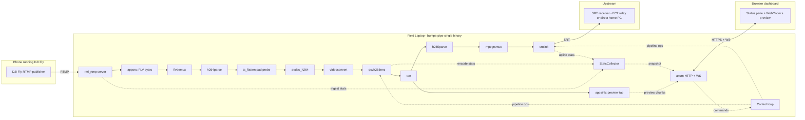

# `bumps-pipe` — design plan

Field-side application that ingests the DJI Fly RTMP stream from the operator's
phone, fixes the timestamp pathology that appears during weak controller links,
hardware-encodes the result to HEVC/AV1 on the laptop's Intel iGPU, ships it
upstream over SRT, and serves a browser-based live preview + status dashboard.

Target environment: NixOS laptop with Intel Core Ultra (QSV/oneVPL). Single Rust
binary, single config file, single web dashboard. No external server processes.

**Confirmed scope** (see §10 for context):
- OS: NixOS — `flake.nix` pulls all runtime deps.
- SRT upstream: AWS (MediaConnect *or* a `t4g.small` running `srt-live-transmit`
  — chosen in `terraform/`, not by this binary; this binary only knows a URI).
- Auth: none. RTMP accepts any publisher; web dashboard binds loopback only.
- Audio: not in scope. Video-only pipeline.
- TLS: none. Plain `http://` and `ws://` on `127.0.0.1`.
- Preview transport: WebSocket. WebTransport was considered and deferred
  (see §3.6).

---

## 1. Goals and non-goals

### Goals

- **Single binary** that does ingest → flatten → encode → SRT out, plus serves a
  preview + status web dashboard.
- **Low operational complexity**: one config file, one systemd unit, one log,
  one URL the pilot opens in a browser.
- **Resilient to flaky inputs**: drone-controller dropouts, phone WiFi
  hiccups, Starlink satellite handovers, AWS reachability blips — none of these
  should require operator intervention.
- **Sub-second preview latency** on the dashboard.
- **Observable**: every leg's health is visible from the dashboard and from
  `/metrics` for later Grafana.
- **Codec-swappable**: HEVC for v1, AV1 as a one-line config change once the
  end-to-end pipeline is solid.

### Non-goals

- Multi-source ingest, multi-bitrate ladders, scene compositing — that's OBS's
  job at the home end, not the field side's.
- Remote operator authentication / multi-tenant access. LAN-only.
- Cross-platform support. Linux + Intel QSV only; macOS and NVIDIA are out of
  scope.
- Built-in cloud relay management. The SRT destination is just a URL in config.

---

## 2. High-level architecture



Two output legs share a single hardware encode:

- **Uplink leg** — `tee → h265parse → mpegtsmux → srtsink` ships the encoded
  HEVC over SRT to the upstream relay.
- **Preview leg** — `tee → appsink` taps the same encoded bitstream, broadcasts
  it to connected browsers over WebSocket. The browser decodes via WebCodecs
  and renders to canvas.

The browser never re-encodes; it consumes the same elementary stream that goes
to SRT. One encode, two destinations.

---

## 3. Components

### 3.1 RTMP ingest (`src/rtmp.rs`)

- **Library**: `rml_rtmp` (pure-Rust RTMP protocol).
- **Responsibility**: accept the publish from DJI Fly, emit `video_data`
  callbacks with raw FLV tag payloads. Audio callbacks are dropped on the
  floor (no audio in scope).
- **Auth**: none. Any `connect` + `publish` succeeds. Stream key is recorded
  for display in the dashboard but not validated.
- **Output**: a `tokio::sync::mpsc` channel of `IngestEvent`s consumed by the
  pipeline:
  ```rust
  enum IngestEvent {
      Connected { stream_key: String, peer: SocketAddr },
      Metadata { width: u32, height: u32, fps: f32, codec: VideoCodec },
      VideoTag { ts_ms: u32, arrival: Instant, payload: Bytes, keyframe: bool },
      Disconnected,
  }
  ```
- **Why not GStreamer's RTMP elements**: `rtmp2src`/`rtmpsrc` are *clients*.
  Stock GStreamer has no RTMP server element. `rml_rtmp` is the simplest path
  to a self-contained binary.
- **Failure handling**: if the publisher disconnects, emit `Disconnected`,
  flush the pipeline, return to listening.

### 3.2 RTMP → GStreamer bridge (`src/rtmp.rs`)

- Reconstruct a minimal FLV bytestream from the incoming tags (FLV header
  once on session start, then concatenated tags) and feed it into the pipeline
  via an `appsrc` element typed as `video/x-flv`.
- Alternative considered: extract H.264 NAL units in Rust and feed `appsrc`
  typed as `video/x-h264, stream-format=avc, alignment=au` directly. Avoids
  flvdemux but means re-implementing AVCC/AnnexB handling. **Decision**:
  start with FLV+flvdemux; it's the smaller risk surface.
- Buffer PTS/DTS on the appsrc-side buffer are set from the incoming RTMP
  timestamp; arrival wallclock is carried as a `GstReferenceTimestampMeta`
  so the flattener can use it later.

### 3.3 Timestamp flattener (`src/pipeline/flatten.rs`)

A pad probe installed on the src pad of `h264parse` (or earlier, depending on
what the data tells us). Rewrites `buffer.pts` and `buffer.dts` in place.

```rust
trait FlattenStrategy: Send {
    fn rewrite(&mut self, buf: &mut gst::BufferRef, meta: &FrameMeta);
}
```

**Initial strategies**:

- `PassThrough` — no-op. For validation against unmodified output.
- `MonotonicRebase` — track previous PTS/DTS, force monotonic non-decreasing
  output, advance by `1/fps` when input would otherwise go backwards.
- `WallclockAnchored` — anchor first frame's PTS to wallclock; subsequent
  frames advance by `1/fps` when input PTS looks plausible, fall back to
  wallclock when input PTS is anomalous (defined as: backward jump, forward
  jump > 5× frame interval, or duplicate).
- `WallclockPure` — ignore source PTS entirely; PTS = arrival wallclock,
  DTS = PTS − reorder offset (0 for live H.264 without B-frames; if B-frames
  present, compute from POC).

Strategy chosen from config; swappable at runtime via the WS control channel
for testing on canned captures.

**Important**: pick the strategy *after* the data collection phase tells us
what the bug actually looks like. The `PassThrough` plus a logging shim is
sufficient for Phase 0 validation that the probe machinery works.

### 3.4 GStreamer pipeline (`src/pipeline/`)

Constructed programmatically via `gstreamer::parse_launch` (for a string
template) or element-by-element via `gst::ElementFactory::make` (for the bits
where we need handles).

Template (HEVC v1):

```
appsrc name=ingest is-live=true do-timestamp=false format=time \
  ! flvdemux name=demux \
demux.video \
  ! h264parse name=parse_h264 \
  ! identity name=flatten \
  ! avdec_h264 \
  ! videoconvert \
  ! video/x-raw,format=NV12 \
  ! qsvh265enc name=enc target-usage=7 rate-control=cbr bitrate=5000 gop-size=60 low-power=true \
  ! tee name=t \
t. ! queue leaky=no max-size-buffers=8 \
   ! h265parse config-interval=-1 \
   ! mpegtsmux \
   ! srtsink name=uplink uri=... wait-for-connection=false \
t. ! queue leaky=downstream max-size-buffers=8 \
   ! appsink name=preview emit-signals=true sync=false
```

- `identity` is the host element for the flatten pad probe. We attach the
  probe to its src pad.
- `tee` lets the encoded stream go to both SRT and the preview tap.
- Both `queue`s after the tee are required by GStreamer — they decouple
  threads and allow the slow leg (SRT) to not block the fast leg (preview)
  and vice versa.
- Preview-leg queue is `leaky=downstream`: if the browser is slow, drop old
  frames before they back up into the encoder.
- Uplink-leg queue is `leaky=no`: dropping uplink frames is much worse than
  growing the encoder queue, since SRT has its own buffer.

### 3.5 Stats collector (`src/stats.rs`)

A tokio task that maintains a `Snapshot` struct, updated from four sources:

| Source            | Mechanism                                                       | Cadence     |
|-------------------|-----------------------------------------------------------------|-------------|
| RTMP ingest       | Counters maintained by `rtmp.rs`, exposed via `Arc<AtomicU64>`s | continuous  |
| Encoder           | Probes on `qsvh265enc` src pad counting bytes & buffers         | continuous  |
| Preview tap       | Counters in the appsink callback                                | continuous  |
| SRT uplink        | `srtsink.property::<gst::Structure>("stats")`                   | poll @ 1 Hz |

The collector publishes via:
- `tokio::sync::watch::<Snapshot>` consumed by WS handlers for fan-out.
- A Prometheus exporter via the `metrics` + `metrics-exporter-prometheus`
  crates for `/metrics`.

**Snapshot shape** (also the JSON sent over WS):

```rust
struct Snapshot {
    ts: SystemTime,
    downlink: DownlinkStats,
    encoder:  EncoderStats,
    preview:  PreviewStats,
    uplink:   UplinkStats,
    pipeline: PipelineHealth,
}

struct DownlinkStats {
    connected: bool,
    peer: Option<SocketAddr>,
    stream_key: Option<String>,
    src_codec: Option<String>,
    src_w: Option<u32>, src_h: Option<u32>, src_fps: Option<f32>,
    src_bitrate_kbps: f32,             // EWMA over last 2s
    frames_in: u64,
    last_frame_age_ms: u32,
    pts_anomalies: u64,                // counter the flattener increments
}

struct EncoderStats {
    codec: String,
    target_bitrate_kbps: u32,
    actual_bitrate_kbps: f32,          // EWMA
    encoded_frames: u64,
    dropped_frames: u64,
    avg_encode_latency_ms: f32,
}

struct PreviewStats {
    clients: u32,
    sent_frames: u64,
    sent_bytes: u64,
    dropped_for_backpressure: u64,
}

struct UplinkStats {
    state: UplinkState,                // Connecting | Connected | Reconnecting | Failed
    rtt_ms: f32,
    bandwidth_mbps: f32,
    send_buf_pct: f32,
    sent_bytes: u64,
    retransmitted_pkts: u64,
    lost_pkts: u64,
    pkt_loss_rate: f32,                // EWMA
}

struct PipelineHealth {
    state: gst::State,
    rollup: HealthRollup,              // Ok | Warn | Bad
    last_error: Option<String>,
    uptime_s: f32,
    restarts: u32,
}
```

### 3.6 WebSocket protocol (`src/wsproto.rs`)

**Why WebSocket and not WebTransport.** WebTransport's wins (proper
backpressure, unreliable datagrams, no HoL blocking) all assume a lossy or
contended path. The dashboard runs on the field laptop binding loopback —
no contention, no loss, sub-millisecond RTT. WebTransport would also force
HTTP/3 and therefore TLS (even with `serverCertificateHashes` to bypass
the trust store, the server still has to mint and rotate a P-256 cert every
14 days). For the configured scope (one local browser, no TLS, no LAN
peers), WebSocket is strictly simpler with no observable downside. The
protocol design below is wire-compatible-shaped enough that swapping the
transport later — if we ever want to view the dashboard from a phone over
Tailscale — is a localised change.

Two message kinds on a single WebSocket connection per browser tab:

**Server → Client**

| Type     | Encoding | When                                          | Payload                                                                                  |
|----------|----------|-----------------------------------------------|------------------------------------------------------------------------------------------|
| `init`   | JSON     | On connect, and whenever encoder caps change  | `{ codec, description (b64), width, height, fps }`                                       |
| `video`  | binary   | Per encoded picture from the preview appsink  | `[ flags:u8 | pts_us:u64 LE | payload:bytes ]`. flag bit 0 = keyframe                    |
| `stats`  | JSON     | 1 Hz                                          | `Snapshot` serialised                                                                    |
| `event`  | JSON     | State changes / errors                        | `{ kind, severity, message, at }`                                                        |

**Client → Server**

All JSON:

| Command               | Effect                                                       |
|-----------------------|--------------------------------------------------------------|
| `request_keyframe`    | Force IDR via `qsvh265enc force-key-unit` event              |
| `set_bitrate`         | Change `qsvh265enc.bitrate`                                  |
| `set_srt_latency`     | Rebuild srtsink with new latency (requires pipeline pause)   |
| `set_flatten`         | Swap `FlattenStrategy`                                       |
| `restart_pipeline`    | Tear down + rebuild pipeline                                 |
| `subscribe_preview`   | Opt-in to receiving `video` frames (stats-only otherwise)    |

The `subscribe_preview` opt-in matters: a browser tab on the status page that
isn't actively previewing should not pay for video traffic. The preview pane
sends `subscribe_preview` when visible and unsubscribes when hidden via
`document.visibilitychange`.

### 3.7 Web server (`src/web/`)

- **axum** + tower-http for routing, static assets, and WebSocket upgrade.
- Static assets bundled via `rust-embed` so the binary ships self-contained.
- Bind: `127.0.0.1:8080` by default. No TLS. The dashboard is consumed by
  a browser running on the same machine; nothing on the network can reach it.

Routes:

| Path           | Method | Purpose                                       |
|----------------|--------|-----------------------------------------------|
| `/`            | GET    | `index.html` (dashboard SPA)                  |
| `/assets/*`    | GET    | Bundled JS/CSS                                |
| `/ws`          | WS     | Preview + stats + control                     |
| `/api/stats`   | GET    | Latest snapshot as JSON (curl / scrape)       |
| `/api/health`  | GET    | Simple liveness probe                         |
| `/metrics`     | GET    | Prometheus scrape                             |

Per-WS-client fan-out uses `tokio::sync::broadcast::Receiver<VideoChunk>` for
video and `tokio::sync::watch::Receiver<Snapshot>` for stats. Each client task
owns a bounded `mpsc` to its WS sink and drops oldest non-keyframe video on
overflow.

### 3.8 Control loop (`src/control.rs`)

A tokio task that:

- Consumes WS client commands and applies them to the pipeline.
- Watches `Snapshot` for unhealthy state and reacts:
  - `UplinkState::Failed` for > N seconds → recreate `srtsink` and reconnect.
  - `pkt_loss_rate` over threshold for sustained period → log warning,
    optionally step encoder bitrate down (configurable; off by default in v1).
  - No incoming RTMP frames for > N seconds → emit `event` to clients,
    keep pipeline alive waiting for re-publish.
- Implements force-keyframe-on-new-client: when a browser connects and
  subscribes to preview, send a keyframe request to the encoder so the
  browser can start decoding immediately rather than waiting for the next
  GOP boundary.

### 3.9 Persistence & debug artifacts (`src/capture.rs`)

Live `/metrics` and the dashboard are great for "right now" — they don't help
debugging a 40-minute flight from yesterday. The persistence layer fixes that.

Strategy: write **per-session artifact directories** to disk while the
session runs. Each directory is self-contained and trivially `scp`able after
the fact. Long-horizon Prometheus storage is delegated to a system-level
VictoriaMetrics, not built into `bumps-pipe`.

**Per-session directory layout** (`$BUMPS_DATA_DIR/sessions/<id>/`):

```
2026-06-14T141501Z-drone-eba91/
├── metadata.json     # session start/stop, source caps, config snapshot, git rev
├── snapshot.jsonl    # one StatsSnapshot per second, gzipped on session close
├── events.jsonl      # state transitions, errors, command applications
├── pipeline.log      # gstreamer bus + tracing logs, level configurable
├── stream.flv        # OPTIONAL: raw RTMP capture (off by default; big)
└── encoded.ts        # OPTIONAL: encoded HEVC MPEG-TS for codec post-mortem
```

Session id format: `<ISO8601-utc>-<stream-key>-<5-char-random>`. Stream key
is sanitised; the random suffix prevents collisions when the same key
publishes twice in a second.

**Writers** are sinks attached to existing signal sources, not new collectors:

- `snapshot.jsonl`: the same `watch::Receiver<Snapshot>` the WS handler uses.
- `events.jsonl`: `tracing` subscriber filtered to `bumps_pipe::events` target.
- `pipeline.log`: `tracing` subscriber, JSON formatter, full level.
- `stream.flv`: tee from the `appsrc` input (before flattening — that's the
  point, you want to see the unmodified bug data).
- `encoded.ts`: extra leg of the GStreamer `tee` →
  `queue ! mpegtsmux ! filesink`.

All writes are bounded-async (`tokio::fs` + bounded channels) so a slow disk
doesn't backpressure the pipeline. On disk-full, the writer logs an error,
closes the file, and the rest of the pipeline continues — capture is
explicitly best-effort.

**Sizes you should expect** (1080p30, HEVC @ 5 Mbps, ~5-minute session):

| File           | Size  | Notes                                     |
|----------------|-------|-------------------------------------------|
| `metadata.json`| < 4 KB | once per session                         |
| `snapshot.jsonl`| ~150 KB | ~500 B × 300 s, gzip to ~30 KB         |
| `events.jsonl` | < 100 KB | bursty around state transitions         |
| `pipeline.log` | 1–5 MB | at INFO; 10× at DEBUG                    |
| `stream.flv`   | ~200 MB | source bitrate × duration                |
| `encoded.ts`   | ~190 MB | encoder bitrate × duration               |

Defaults: stats + events + log ON, raw + encoded captures OFF. Turn captures
on for debug flights via config or the dashboard's command palette.

**Retention**: a background task at startup walks the sessions dir and
deletes oldest entries past `[capture].retention_sessions` (default 20) or
past `[capture].max_disk_gb` (default 20), whichever hits first. No
external log rotator needed.

**Long-horizon metrics**: the `/metrics` Prometheus endpoint is enough for
real-time. For multi-day trend analysis, point a system-level
**VictoriaMetrics** (single binary, ~5 MB, 1-line NixOS module) at
`http://127.0.0.1:8080/metrics`. VM stores compactly (~1.5 bytes/sample),
exposes a Prom query API, and Grafana can read it directly. Recommendation:
not in v1, add when there's something to look at.

### 3.10 Frontend (`frontend/`)

- **Stack**: TypeScript + Vite. No framework — the UI is small enough.
  Tailwind for styling because it's quick.
- **Bundled into the Rust binary** via `rust-embed` at build time.
- **Layout**: one page, three regions:
  - Top bar: health rollup (large GO/WARN/BAD indicator) + uptime + restart
    count + current source identity.
  - Main pane: live preview canvas, ~50% of the page.
  - Side pane: four collapsible cards — Downlink, Encoder, Preview, Uplink —
    each surfacing the matching `Snapshot` substructure with sparkline charts
    for bitrate / RTT / loss.
  - Footer: a small command palette (request keyframe, restart pipeline,
    swap flatten strategy) gated behind a "show advanced" toggle.
- **Preview rendering**:
  - `VideoDecoder` configured from the `init` message.
  - Decoded `VideoFrame`s drawn to a `<canvas>` in `requestAnimationFrame`,
    closing each frame after draw.
  - On tab hidden, unsubscribe and tear down decoder; on visible, resubscribe
    and re-init.
- **Sparklines**: tiny custom canvas, no chart library. ~30 lines.

---

## 4. Repository layout

```
bumps-video/
├── Cargo.toml
├── Cargo.lock
├── flake.nix
├── .envrc
├── .gitignore
├── docs/
│   └── plan.md                      # this document
├── scripts/
│   └── record-rtmp.sh               # data collection (already exists)
├── terraform/                       # AWS relay infra (already exists)
├── src/
│   ├── main.rs                      # CLI entrypoint, signal handling, top-level wiring
│   ├── config.rs                    # serde + clap merged config
│   ├── rtmp.rs                      # rml_rtmp server + FLV reassembly
│   ├── pipeline/
│   │   ├── mod.rs                   # Pipeline struct, lifecycle, restart
│   │   ├── build.rs                 # element construction, linking, caps
│   │   ├── bus.rs                   # bus message handling, error rollup
│   │   ├── flatten.rs               # pad probe + FlattenStrategy impls
│   │   └── preview.rs               # appsink → broadcast channel plumbing
│   ├── stats/
│   │   ├── mod.rs                   # Snapshot type + watch channel
│   │   ├── collector.rs             # tokio task wiring stats sources
│   │   └── prom.rs                  # Prometheus exporter glue
│   ├── web/
│   │   ├── mod.rs                   # axum router
│   │   ├── ws.rs                    # WS handler + framing
│   │   ├── api.rs                   # /api/stats, /api/health
│   │   └── assets.rs                # rust-embed
│   ├── control.rs                   # WS commands → pipeline ops + auto-recovery
│   ├── capture/
│   │   ├── mod.rs                   # session dir lifecycle, retention sweep
│   │   ├── jsonl.rs                 # snapshot + events writers
│   │   └── streams.rs               # optional raw FLV + encoded TS sinks
│   └── wsproto.rs                   # wire protocol types (shared with frontend via TS types regenerator)
├── frontend/
│   ├── package.json
│   ├── vite.config.ts
│   ├── tsconfig.json
│   ├── tailwind.config.js
│   ├── index.html
│   ├── src/
│   │   ├── main.ts
│   │   ├── ws.ts                    # WS client + reconnect
│   │   ├── decoder.ts               # VideoDecoder setup, lifecycle
│   │   ├── renderer.ts              # canvas + rAF render loop
│   │   ├── stats/
│   │   │   ├── store.ts             # latest snapshot store
│   │   │   ├── panel.ts             # status pane DOM
│   │   │   └── sparkline.ts
│   │   ├── controls.ts              # command palette
│   │   └── styles.css
│   └── dist/                        # built assets, gitignored, embedded at build
└── config/
    └── example.toml                 # documented example config
```

Build of the frontend is driven from `build.rs` (or a Cargo feature gated by
presence of `frontend/dist/`). For dev iteration, run `vite dev` separately
and proxy `/ws` to the Rust binary.

---

## 5. Configuration

`config.toml` example:

```toml
[rtmp]
listen = "0.0.0.0:1935"
app    = "live"                   # informational; any value accepted on connect

[ingest]
flv_buffer_kib = 256              # internal reassembly buffer
drop_audio     = true             # v1: no audio path

[flatten]
strategy = "wallclock_anchored"   # "passthrough" | "monotonic_rebase" | "wallclock_anchored" | "wallclock_pure"
target_fps = 30                   # used by strategies that need a frame interval

[encoder]
codec        = "hevc"             # "hevc" | "av1" | "h264"
bitrate_kbps = 5000
preset       = "veryfast"         # mapped to qsv target-usage
gop_size     = 60                 # frames; ≈ 2s at 30fps
low_latency  = true               # qsv: target-usage=7 + low-power=true + lookahead off
rate_control = "cbr"              # "cbr" | "vbr"

[srt]
uri = "srt://relay.example.com:9999?mode=caller&latency=2500&streamid=publish:drone&pbkeylen=0"
auto_reconnect = true
reconnect_backoff_ms = [1000, 2000, 4000, 8000, 15000]

[preview]
enabled = true
broadcast_queue_frames = 120      # bounded broadcast capacity
client_queue_frames = 30          # per-client send queue

[web]
listen = "127.0.0.1:8080"         # loopback only; LAN-bind would need TLS later

[capture]
data_dir              = "~/.local/share/bumps-pipe"
snapshot_jsonl        = true      # 1 Hz stats — always cheap, on by default
events_jsonl          = true      # state transitions, errors — always cheap
pipeline_log          = true      # gst bus + tracing — INFO level by default
raw_flv               = false     # ~40 MB/min; turn on for debug flights
encoded_ts            = false     # ~37 MB/min; turn on for codec post-mortem
retention_sessions    = 20
max_disk_gb           = 20

[control]
auto_keyframe_on_connect = true
auto_bitrate_adapt = false        # off in v1
no_input_grace_secs = 30          # tolerance before declaring source dead

[logging]
level  = "info"
format = "json"                   # "json" | "pretty"
```

Overrides via CLI: `bumps-pipe --config /etc/bumps.toml --srt-uri srt://...`.

---

## 5a. Lifecycle: who restarts what

This is the question that drives most of the resilience design. The short
version: **the binary process is long-lived and you never restart it for any
in-stream event**. The publisher disconnects, the network drops, the encoder
errors, the SRT receiver dies — none of those touch the process.

Three nested lifecycles:

```
┌──────────────────────────────────────────────────────────────────────┐
│ process lifetime (systemd unit; only dies on crash or operator stop) │
│  ┌──────────────────────────────────────────────────────────────┐    │
│  │ RTMP listener (rml_rtmp tokio task, always bound to :1935)   │    │
│  │  ┌────────────────────────────────────────────────────────┐  │    │
│  │  │ publisher session (one phone "go live" press)          │  │    │
│  │  │  ┌──────────────────────────────────────────────────┐  │  │    │
│  │  │  │ GStreamer pipeline (built per session, NULL→     │  │  │    │
│  │  │  │  PLAYING on first frame, NULL on disconnect)     │  │  │    │
│  │  │  └──────────────────────────────────────────────────┘  │  │    │
│  │  └────────────────────────────────────────────────────────┘  │    │
│  └──────────────────────────────────────────────────────────────┘    │
└──────────────────────────────────────────────────────────────────────┘
```

- The **RTMP listener** is a single tokio task that calls `TcpListener::bind`
  once at startup and accepts forever. Any number of publisher sessions over
  its lifetime.
- A **publisher session** begins on `connect` + `publish` and ends on TCP
  close, RTMP `deleteStream`, or the inactivity watchdog. Sessions are
  independent — caps may differ, stream key may differ.
- The **GStreamer pipeline** is built on the first video tag of a session,
  torn down to NULL on session end. Pipeline lifetime ⊆ session lifetime.

Why rebuild the pipeline per session rather than keeping it warm:
- Source caps may change between sessions (operator switches drone resolution,
  app version updates). Rebuild handles this for free.
- GStreamer state machine + flushing across an EOS is fiddly; full teardown
  is simpler and the cost (~200–500ms) is invisible because the publisher
  takes longer than that to send first frame anyway.
- WS clients survive across rebuilds because they're rooted at the process,
  not the pipeline. They see an `event` message when the source goes away
  and another when it returns.

What happens on each event:

| Event                                         | Process | RTMP listener | Publisher session | GStreamer pipeline |
|-----------------------------------------------|---------|---------------|-------------------|--------------------|
| Operator presses "go live" in DJI Fly         | up      | up            | **start**         | **build → PLAY**   |
| Operator presses "stop" / kills the app       | up      | up            | **end**           | **PLAY → NULL**    |
| Operator presses "go live" again              | up      | up            | **start**         | **build → PLAY**   |
| Phone WiFi blip, TCP resets                   | up      | up            | end               | NULL               |
| Phone reconnects, re-publishes                | up      | up            | start             | build → PLAY       |
| Drone-controller link lost (phone keeps RTMP) | up      | up            | unchanged         | running; PTSes get weird, flattener handles |
| SRT receiver in AWS becomes unreachable       | up      | up            | unchanged         | running; srtsink retries with backoff       |
| Pipeline panics                               | up      | up            | unchanged         | **rebuild**        |
| Process panics                                | **systemd restarts** | (rebound on restart) | new            | new                |

You only ever restart the binary for: a new build, or a real crash that
recovery can't catch. Not for any in-flight stream event.

## 6. Failure modes & recovery

| Failure                                             | Detection                                    | Response                                                                |
|-----------------------------------------------------|----------------------------------------------|-------------------------------------------------------------------------|
| Phone disconnects RTMP                              | `rml_rtmp` connection close                  | Flush pipeline, return to listen state, emit `event` to clients         |
| RTMP packets stop arriving but TCP still open       | Watchdog: no frame for `no_input_grace_secs` | Mark downlink red, hold pipeline; auto-recover on next frame            |
| Flattener detects PTS chaos                         | Anomaly counter increments                   | Counter surfaced in stats; strategy continues per its policy            |
| Encoder error or hang                               | GStreamer bus error / no buffers out for N s | Rebuild pipeline, retain WS clients, send `event`                       |
| SRT receiver unreachable                            | `srtsink` state → error                      | Backoff reconnect per config; `uplink.state = Reconnecting`             |
| SRT high loss                                       | `pkt_loss_rate` over threshold sustained     | Warn; optional bitrate step-down if `auto_bitrate_adapt` enabled        |
| WebSocket client slow                               | Per-client send queue full                   | Drop oldest non-keyframe; force keyframe on recovery                    |
| WebSocket client disconnect                         | WS close                                     | Drop client task, no other impact                                       |
| GStreamer thread panic                              | `panic::catch_unwind` around pipeline task   | Restart pipeline subsystem; if restart fails 3× in 60s, exit non-zero   |
| `bumps-pipe` crash                                  | systemd                                      | `Restart=on-failure` with `RestartSec=2`                                |
| Laptop sleep / lid close                            | OS                                           | Out of scope; document "keep the lid open"                              |

The recovery actions all happen *without* taking the web dashboard down. The
browser sees an `event` message, the rollup goes red, and recovery progress
is visible.

---

## 7. Phasing

Each phase produces a runnable artifact and a validation criterion. Don't
move to phase N+1 until phase N validates.

### Phase 0 — Characterise the bug
- **Status**: tooling exists (`scripts/record-rtmp.sh`). Need real captures.
- **Deliverable**: 3+ session recordings (clean baseline, weak signal, forced
  loss), analysis notes in `docs/timestamp-analysis.md`.
- **Validates**: which `FlattenStrategy` is actually required.

### Phase 1 — Minimum viable pipeline
- Cargo project skeleton, `gstreamer-rs` integration, `rml_rtmp` ingest.
- Static pipeline RTMP-in → `PassThrough` flatten → `qsvh265enc` → SRT-out.
- CLI flags only; no config file yet.
- Local SRT receiver for testing (`ffplay 'srt://127.0.0.1:9999?mode=listener'`).
- **Validates**: gstreamer-rs builds and runs, QSV hardware encode works on
  the actual laptop, SRT output reaches a local listener, pipeline survives
  publisher disconnect/reconnect.

### Phase 2 — Preview WebSocket + WebCodecs
- axum HTTP + WS endpoint.
- Preview tee + appsink in the pipeline.
- Frontend `index.html` + `decoder.ts` + `renderer.ts`.
- `init` and `video` messages only; no stats yet.
- **Validates**: end-to-end WS framing, WebCodecs configure with HEVC AVCC
  description, monotonic timestamps decode cleanly, preview latency under
  ~500ms on LAN.

### Phase 3 — Stats collection + dashboard + JSONL persistence
- `StatsCollector` task, `Snapshot` type, watch channel.
- `stats` WS messages, frontend panels, health rollup.
- `/api/stats` + `/metrics` endpoints.
- Session-directory writer for `snapshot.jsonl` + `events.jsonl` +
  `pipeline.log` + `metadata.json` (raw/encoded capture deferred).
- Retention sweep on startup.
- **Validates**: numbers move plausibly when the link is stressed; uplink
  reconnect is observable from the dashboard; a post-session `jq` over
  `snapshot.jsonl` reproduces the trends seen live.

### Phase 4 — Timestamp flattener
- Implement `MonotonicRebase` and `WallclockAnchored` strategies.
- Anomaly counters.
- Offline harness: feed a recorded `.flv` from Phase 0 through the pipeline
  in playback mode, dump output to file, compare PTS series before/after.
- **Validates**: the bug is actually fixed against captured data.

### Phase 5 — Control loop + resilience
- Auto-reconnect on SRT failure with backoff.
- Force-keyframe on client connect.
- Client → server WS commands.
- Pipeline panic recovery.
- **Validates**: kill the SRT receiver mid-stream → recovers without
  operator action. Kill the pipeline thread → recovers without operator
  action. Disconnect/reconnect the publisher 10× → no leaks.

### Phase 6 — AV1 swap (optional / experimental)
- Swap `qsvh265enc` for `qsvav1enc`, verify downstream
  (mpegtsmux + srtsink + AWS receiver + browser WebCodecs) all cope.
- Likely to expose at least one bug in `mpegtsmux`'s AV1 path or at the
  AWS receiver end. Keep HEVC as the default until each leg is confirmed.
- **Validates**: AV1 as a one-line config change works end-to-end. If it
  doesn't, that's a real result — stay on HEVC and ship.

### Phase 7 — Field hardening
- systemd unit file.
- Config validation with sensible errors.
- Embed frontend, single binary deploy.
- Optional raw FLV + encoded TS capture sinks (toggleable from dashboard).
- Optional VictoriaMetrics module in `nixos-host/` for multi-day metric
  retention + Grafana — host-level config, not part of the binary.
- Smoke-test script.
- Run a 4-hour soak test indoors before taking it outside.
- **Validates**: ready for actual flight.

---

## 8. Dependencies (Rust crates)

| Crate                              | Why                                                 |
|------------------------------------|-----------------------------------------------------|
| `tokio`                            | Async runtime                                       |
| `gstreamer`, `gstreamer-app`, `gstreamer-video` | Pipeline + appsrc/appsink + caps types    |
| `glib`                             | GStreamer's main loop integration                   |
| `rml_rtmp`                         | RTMP server                                         |
| `bytes`                            | Zero-copy buffer handling                           |
| `axum`, `tower`, `tower-http`      | HTTP + WS                                           |
| `tokio-tungstenite` (via axum)     | WS implementation                                   |
| `rust-embed`                       | Bundle frontend assets                              |
| `serde`, `serde_json`, `toml`      | Config + WS JSON                                    |
| `clap`                             | CLI                                                 |
| `tracing`, `tracing-subscriber`    | Structured logs                                     |
| `metrics`, `metrics-exporter-prometheus` | Prometheus output                             |
| `anyhow`, `thiserror`              | Error handling                                      |
| `parking_lot`                      | Mutex                                               |
| `humantime-serde`                  | Config durations                                    |

## 9. System dependencies (Nix)

NixOS field laptop. Two surfaces:

**`flake.nix` devShell** (build + run from a dev checkout):
- `gst_all_1.gstreamer`
- `gst_all_1.gst-plugins-base`
- `gst_all_1.gst-plugins-good`
- `gst_all_1.gst-plugins-bad` (provides QSV, SRT, MPEG-TS muxer)
- `gst_all_1.gst-libav` (provides `avdec_h264`)
- `intel-media-driver` + `libvpl` (QSV/oneVPL runtime)
- `pkg-config`
- `rustc`/`cargo` via `rustup` or `fenix`
- `nodejs_22` + `pnpm` (frontend build)
- Existing: `ffmpeg`, `python3` (data tools)

**NixOS host config** (so the iGPU is usable):
- `hardware.graphics.enable = true`
- `hardware.graphics.extraPackages = with pkgs; [ intel-media-driver libvpl vpl-gpu-rt ];`
- User in the `video` and `render` groups
- Optional: `boot.kernelParams = [ "i915.enable_guc=3" ]` for newer Intel iGPUs

The runtime QSV plugin (`gst-plugins-bad`) must be the same Nixpkgs revision
as `libvpl` / `vpl-gpu-rt` — pin via the flake to avoid mismatch.

---

## 10. Resolved decisions

| Question                              | Decision                                                                                   |
|---------------------------------------|--------------------------------------------------------------------------------------------|
| Field laptop OS                       | NixOS. All deps via `flake.nix` + host config (see §9).                                    |
| SRT receiver for development          | A small AWS resource (MediaConnect flow *or* `t4g.small` running `srt-live-transmit`).     |
|                                       | Choice deferred to `terraform/`. The binary only knows a URI.                              |
| Stream key auth                       | None. RTMP listener accepts any publisher.                                                 |
| Audio                                 | Not in scope. Audio FLV tags dropped; no audio elements in pipeline.                       |
| TLS on the web dashboard              | None. Binds `127.0.0.1` only.                                                              |
| Single user / multiple tabs           | Single user. Multiple tabs work but discouraged; not a target.                             |
| WebTransport vs WebSocket             | WebSocket. WebTransport's wins don't materialise on loopback; see §3.6.                    |

## 10a. Remaining open questions

Things that still need a real answer, but are scoped down enough not to block
Phase 1.

1. **AWS SRT receiver shape**. MediaConnect (~$0.20/hr/flow + egress) is
   managed and observable; `srt-live-transmit` on a `t4g.small` (~$15/mo flat)
   is cheaper and more controllable. For a one-operator setup the EC2 option
   is probably right; revisit in `terraform/` once Phase 1 is shipping bytes.
2. **Pipeline-restart-on-reconnect vs. keep-warm**. See §6 — current design
   rebuilds on each publisher session. Probably fine; revisit if reconnect
   latency turns out to matter.
3. **Encoder bitrate adaptation**. Off in v1. The decision to turn it on
   should follow seeing real SRT stats from a real Starlink session, not
   guessing thresholds now.

---

## 11. Risks

| Risk                                                          | Likelihood | Impact | Mitigation                                                            |
|---------------------------------------------------------------|------------|--------|-----------------------------------------------------------------------|
| FLV reassembly bug between `rml_rtmp` and `flvdemux`          | Medium     | High   | Bypass plan: feed `appsrc` H.264 caps directly, skip flvdemux         |
| QSV plugin missing or wrong version on chosen distro          | Medium     | High   | Verify on actual hardware in Phase 1, before architecture commits     |
| WebCodecs HEVC decode not enabled in user's Chromium build    | Low        | Medium | Fall back to H.264 elementary stream for the preview leg              |
| Clock drift between GStreamer pipeline clock and srtsink      | Medium     | Medium | Use the system clock for both, monitor srtsink stats for buffer bloat |
| AV1 in MPEG-TS over SRT fails downstream                      | High       | Low    | Keep HEVC as default; AV1 is a Phase 6 experiment                     |
| Single-binary frontend embedding bloats dev rebuild times     | Low        | Low    | Make frontend embedding a release-only feature                        |
| Tokio + glib main loop integration is fiddly                  | Medium     | Medium | Use `gstreamer::glib::MainContext::default().spawn_local` pattern     |

---

## 12. What this plan deliberately omits

- **Cloud relay shape.** The SRT URI is just a config value. Whether it's
  MediaConnect, a `t4g.small` running `srt-live-transmit`, or a direct
  connection to the home PC is decided by `terraform/`, not by this binary.
- **OBS / streaming destination.** Out of scope at the field end.
- **Long-term storage of raw captures.** The companion `record-rtmp.sh`
  script already covers test capture; production capture-to-disk can be
  added as a parallel `tee → filesink` leg in a future phase if wanted.
- **GPU vs CPU decode choice.** Software decode via `avdec_h264` is cheap
  enough for 1080p30 and avoids a second iGPU context switch. If profiling
  shows it's a bottleneck, swap to `qsvh264dec` later.
